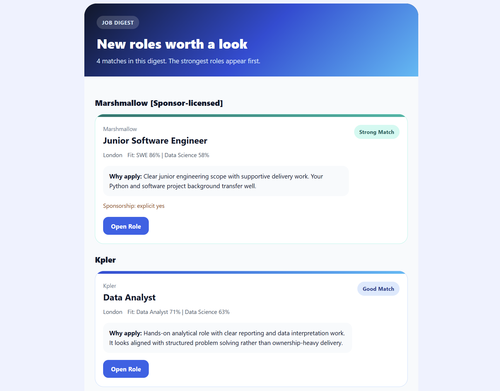

# Job Scraper
### For Entry-Level and Junior Roles in Tech

Scrapes public job boards, ranks roles against configurable recipient profiles, and sends grouped email digests.

  

## Intended Usage

This project is primarily meant to run as a scheduled GitHub Actions workflow with persistent seen-job storage.

Typical setup:
- fork the repo
- configure GitHub Actions secrets and variables
- let the workflow run on schedule

## What It Does

- loads public job-board targets from config
- scrapes Ashby, Greenhouse, Lever, and selected Next.js boards
- ranks jobs separately for each recipient profile with semantic matching
- optionally reranks top semantic matches with Gemini for stricter final selection
- skips jobs already reviewed for that recipient
- sends grouped email digests

## Matching Modes

- semantic-only mode
  Used when `GEMINI_API_KEY` is not set.
- semantic + Gemini rerank mode
  Used when `GEMINI_API_KEY` is set.

Important Gemini behavior:
- reviewed jobs are stored as seen, even if Gemini rejects them
- if Gemini is enabled but unavailable, the app does not fall back to the semantic shortlist for that run
- the first Gemini-enabled run can cost more because many unseen jobs may be reviewed at once

## Setup

Recommended setup:
1. Fork the repo.
2. Create a Postgres database and save the connection string as `DATABASE_URL`.
3. Add your sender email and app password.
4. Add `RECIPIENT_PROFILES_JSON`.
5. Optionally add `GEMINI_API_KEY`.
6. Run the workflow manually once, then enable the schedule.

The full step-by-step setup, variable reference, recipient profile controls, and target override documentation are in [docs/CONFIGURATION.md](docs/CONFIGURATION.md).

Starter config files and example shapes are in [examples/README.md](examples/README.md).

## Local Run

Local runs are mainly for testing, debugging, or tuning config before pushing changes.

1. Create and activate a virtual environment.
2. Install dependencies with `pip install -r requirements.txt`.
3. Set the needed environment variables.
4. Run `python run_all.py`.

By default, local runs use SQLite in `job_scraper.db`. Hosted runs should use Postgres via `DATABASE_URL`.

## Extra Tools

- `python manage_targets.py list`
- `python manage_targets.py list ashby`

## Database

`recipient_seen_jobs` stores seen job URLs per recipient profile.

## Acknowledgements

OpenAI Codex / GPT-5.4 for development assistance.

Sample sponsor list from [Borderless](https://uk-sponsors.getborderless.co.uk/sponsors), which states that data is sourced from GOV.UK.

## License

This project is licensed under the [MIT License](LICENSE).

## Responsible Use

- Use public job boards only.
- Keep request volume low.
- Respect source terms and policies.
- Do not automate applications or scrape non-public data.
